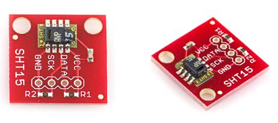
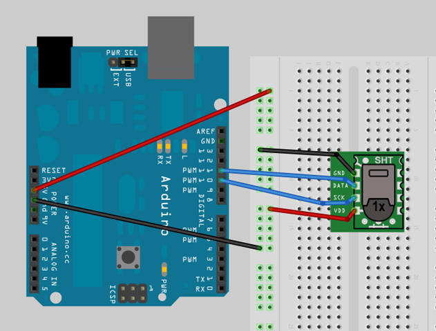
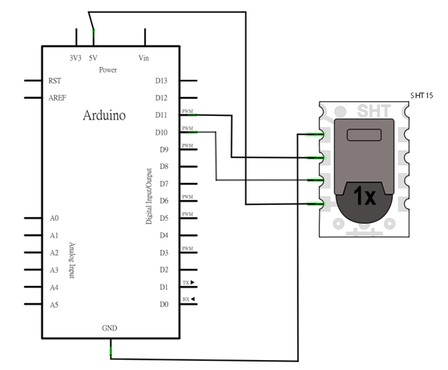
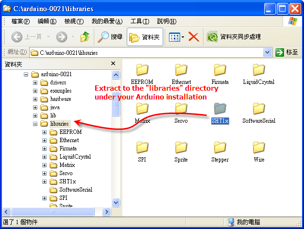

## Arduino入門教學(10) – 使用 SHT15 溫溼度計 (作者：Cooper Maa)

### 實驗目的

練習使用 SHT15 溫溼度計，將讀到的溫溼度讀值輸出到 Serial Port 上。下圖為 SHT15 模組的外觀:



### 材料

* 麵包板 x 1
* Arduino 主板 x 1
* SHT15 Breakout Board (分接板) x 1
* 單心線 x N
* 接線
* 將 SHT15 的 VCC 接到 Arduino 的 +5V，GND 接到 Arduino 的 GND
* 將 SHT15 的 Data 腳接到 pin11, SCK 接到 pin10



實際接線照片:


### 電路圖



### SHT1x 函式庫

關於 SHT1x 溫溼計，原本使用程序是很繁瑣的(見 SHT1x and SHT7x Sample Code)，SHT1x Library 已經把事情變簡單了，現在只要安裝 SHT1x Library，就可以很輕鬆地讀取 SHT1x 系列(SHT10, SHT11, SHT15) 溫溼度計的讀值。

SHT1x Library 的安裝辦法很簡單，先到官網或直接點此下載函式庫後，把檔案解壓縮放到 Arduino 的 Libraries 資料夾底下即可:



### 程式碼

底下是 SHT15 溫溼度計的讀取範例，程式讓 Arduino 向 SHT15 讀取資料，並將讀到的溫溼度讀值輸出到 Serial Port，每秒鐘做一次(ReadSHT1x.pde)：

```CPP
/* Lab10 - SHT1x 系列(SHT10, SHT11, SHT15)溫溼度計的讀取範例
 * 
 * 須安裝 SHT1x Library:
 *    https://github.com/practicalarduino/SHT1x/
 */

#include <SHT1x.h>

// 定義 SHT1x 連接的腳位
#define dataPin  11
#define clockPin 10

// 初始化 sht1x 物件
SHT1x sht1x(dataPin, clockPin);

void setup()
{
   Serial.begin(9600);
}

void loop()
{
  // 宣告三個變數&#65292;分別代表溫度(攝氏), 溫度(華氏) 以及溼度
  float temp_c, temp_f, humidity;

  // 讀取 SHT1x 溫溼度值
  temp_c = sht1x.readTemperatureC();
  temp_f = sht1x.readTemperatureF();
  humidity = sht1x.readHumidity();

  // 將讀到的溫溼度讀值輸出至 Serial Port
  Serial.print("Temperature: ");
  Serial.print(temp_c, 1);  // 顯示到小數點後一位
  Serial.print("C / ");
  Serial.print(temp_f, 1);  // 顯示到小數點後一位
  Serial.print("F. Humidity: ");
  Serial.print(humidity);
  Serial.println("%");

  delay(1000);
}
```

### 範例照片／影片

上傳程式到 Arduino 後，打開 Serial Monitor，就會看到 Arduino 送過來的溫溼度資料，如下圖：


### 動動腦

試修改程式，把從 SHT15 讀到的溫溼度資料輸出到 2x16 的 LCD 上。2x16 LCD 的使用方法可參考「 [Lab9 在 2x16 LCD 上顯示 "Hello World” 訊息](http://coopermaa2nd.blogspot.com/2010/12/arduino-lab9-2x16-lcd-world.html) 」
Arduino 現在可以把溫溼度資料送到 Serial Port，試在 PC 端寫一支「溫溼度 Data Log」程式，把 Arduino 送過來的溫溼度資料寫到資料庫，資料庫軟體任君選擇，要用 Excel, Access, SQLite 或 MySQL 都可以。

使用你熟悉的工具(如 Excel, JavaScript/flot, Tcl)，繒製一張每日溫溼度曲線度。

### 延伸閱讀

* [Sensirion SHT1x Datasheet](http://www.sensirion.com/en/pdf/product_information/Datasheet-humidity-sensor-SHT1x.pdf)
* [SHT1x and SHT7x Sample Code](http://www.sensirion.com/en/pdf/product_information/Sample_Code_humidity_sensor_SHTxx.pdf)
* [Sparkfun - SHT15 Breakout board](http://www.sparkfun.com/products/8257)
* [SHT1x Library for Arduino](https://github.com/practicalarduino/SHT1x)

【本文作者為馬萬圳，原文網址為： <http://coopermaa2nd.blogspot.tw/2010/12/arduino-sht15.html> ，由陳鍾誠編輯後納入本雜誌】
