## R 講題分享 – 在雲端運算環境使用 R 和 MPI (作者：Taiwan R User Group)

### 前言

最近大數據成為顯學，人人都在談論大數據，而且大部分的人都在運用Hadoop來處理大數據。

但是如果要做機器學習，或是統計模型估計時，常常需要使用疊代(iteration)。由於Hadoop是在硬碟上運作的系統，所以在疊代演算法的表現並不好。如果能夠將資料全部裝進記憶體中，那可以大大增加運算效能。

### 如何獲取足夠的記憶體

原本記憶體很貴，所以一般人無法把太大的數據放入記憶體中分析。五年前想要對數GB的資料作機器學習或模型配適，對於一般人來說可能是不可能的。但是我們要將GB等級，甚至是TB等級的數據放在記憶體做分析，已經不是不可能了，所需要的費用也是可以負擔的起。

由於硬體的進步，現在要弄到大記憶體的機器已經比以前相對簡單了。一種方法是買一台大記憶體的電腦。現在32G記憶體的電腦大約需要台幣3萬左右，64G記憶體的電腦在台幣10萬左右也可以入手。但是要買到記憶體能夠插到1T的機器，可能還是太昂貴。 [Oracle SAP HANA Rival Exalytics](http://www.pcworld.com/article/247903/oracle_reveals_pricing_for_its_sap_hana_rival_exalytics_signaling_imminent_release.html) 內列的1TB記憶體的機器在去年年初仍需要135,000美元。

另外一種方法就是把機器串起來，也就是分散式系統。讀者應該可以注意到，兩台32G的電腦比一台64G的便宜！當然，我們付出的代價就是要撰寫比較複雜的程式，以及要承擔網路延遲。 [MPI(Message Passing Interface)](http://en.wikipedia.org/wiki/Message_Passing_Interface) 是一個傳統的計算協定。透過MPI的實作，如[OpenMPI](http://www.open-mpi.org/)，我們可以把若干台電腦串起來，協同工作，解決大數據的問題。而MPI是除了Hadoop之外，另一種可以建構分散式運算的工具。

### MPI + R 仍然是一種可用的解決方案

過去MPI主要是用於解決程序間通訊問題，而且許多MPI的程式要用C來撰寫，導致開發速度低落。其實現在MPI已經可以和許多更高階的語言中使用，例如R就有套件讓開發者可以在R中使用MPI，以提升開發效率。

MPI令一個讓人卻步的因素是設定繁瑣，而且需要環境一致的運算環境。由於雲端運算的進步，我們已可以方便的在各式供應商，如 [AWS(Amazon Web Service)](http://en.wikipedia.org/wiki/Amazon_Web_Services) 上租用數十台，甚至是數百台環境一模一樣的虛擬機器。因此這部分的問題也已經獲得解決。

和Hadoop相比，Hadoop現在也有基於Memory的工具，如： [Spark](http://spark.incubator.apache.org/)和[Shark](https://github.com/amplab/shark/wiki) 。但是這一切都是要有Hadoop系統才能開始使用這些工具。我相信很多讀者手上數據不小，但是也沒有大到要用Hadoop，那本篇文章介紹的MPI + R 的工具可能就是讀者所需要的。

在這篇文章中，筆者將介紹如何在R利用MPI和AWS，並且Demo一個以23個Instance，在數分鐘內對上億筆資料做 [羅吉斯迴歸(Logistic Regression)](http://en.wikipedia.org/wiki/Logistic_regression) 的例子。

### 未解決的問題

然而，如何將資料分散到數十台或數百台機器上，仍然是重要的問題。這篇文章並無法解答這個問題。但是在閱讀這篇文章之後，我們仍可以避開架設Hadoop的必要性。 [如果資料沒這麼大，企業是不必用Hadoop的(Don't use Hadoop - your data isn't that big)。](http://www.chrisstucchio.com/blog/2013/hadoop_hatred.html) [(譯文)](http://geek.csdn.net//news/detail/2780)。

普遍來說，數據在每次處理後都是會更精粹，量也會變小。本篇的方法並不適用於處理初始資料，而是有前處理過後的資料。以筆者的經驗，資料經過前處理後應當可以降低十倍甚至百倍的空間。

### R 和 MPI

在過去，R就已經能運用MPI做分散式運算了。最常見的底層套件就是 [`Rmpi`](http://www.stats.uwo.ca/faculty/yu/Rmpi/) 。基於`Rmpi`之上的還有 [`snow`](http://cran.r-project.org/web/packages/snow/index.html) 和 [`foreach`](http://cran.r-project.org/web/packages/foreach/index.html) 等比較高階的運算套件。

[pbdR: Programming with Big Data in R](http://r-pbd.org/) 是2012年的專案，它以MPI為底層，並且設計成讓使用者以 [SPMD](http://en.wikipedia.org/wiki/SPMD) 架構來撰寫分散式演算法( [`pbdMPI`](http://cran.r-project.org/web/packages/pbdMPI/index.html) )。同時他也提供好用的資料結構(如 [`pbdDMAT`](http://cran.r-project.org/web/packages/pbdDMAT/index.html) 分散式矩陣和向量)和測量運算時間( [`pbdPROF`](http://cran.r-project.org/web/packages/pbdPROF/index.html) )等工具。

以筆者的經驗，在雲端運算環境之下，`pbdMPI`可能是R中最好的工具。若讀者有任何指教，非常歡迎來信建議。

更完整的介紹，請參考 [High-Performance and Parallel Computing with R](http://cran.r-project.org/web/views/HighPerformanceComputing.html)。

### 在AWS架設MPI 環境

這裡以ubuntu 13.04為例，簡單介紹如何快速的在AWS預設的ubuntu 13.04 instance上架設MPI環境。限於篇幅，這裡假定讀者已經知道如何租用AWS的虛擬機器了。

**建議讀者在防火牆設定時打開所有的TCP port**

我們用完就關閉虛擬機器了，所以安全上的疑慮應該還好。

### 使用Public AMI

筆者有在US East(N. Virginia)釋出兩個AMI，想要快速嘗試的讀者可以直接用AMI來建立虛擬機器，這樣就可以省略許多設定步驟。相關的設定方法請參考影片： <http://youtu.be/m1vtPESsFqM> 。

AMI id:

- MPI-master: ami-adeba1c4
- MPI-slave: ami-c9eba1a0

### 安裝需要的工具

筆者很喜歡ubuntu的套件庫，因為它們已經納入許多R相關的套件：

1. 在shell底下安裝R和`openmpi`

    ```sh
    sudo apt-get update
    sudo apt-get install r-base openmpi-bin samba cifs-utils
    sudo apt-get build-dep r-cran-rmpi
    ```
2. 在R 底下安裝`pbdMPI`

    ```r
    install.packages('pbdMPI')
    ```

ps. `cifs-utils` 套件是因為筆者使用 samba 服務讓 slave 掛載 master 的磁碟，如果讀者要用其他方式，則請在 slave 上安裝對應的套件。

Slave的設定到此為止，接下來把這個虛擬機器建立成AMI，並取名叫 `MPI-slave` 。但是 Master 還需要額外的設定。請讀者先不要關閉機器，接續做以下的設定。

### Samba(選擇性)

筆者是利用samba來讓所有機器掛載同樣的遠端磁碟，以進行SPMD架構的分析。熟悉NFS或其他遠端硬碟設定方式的讀者，可以按照自己習慣的方式做設定。

1. 先建立`Repository`目錄：

    ```sh
    mkdir -p ~/Repository
    ```

2. 分享資料夾
在`/etc/samba/smb.conf`最底下加入：

```
[Repository]
   path = /home/ubuntu/Repository
   browseable = no
   read only = yes
   guest ok = yes
```

3. 重新啟動samba

```sh
sudo testparm
sudo service smbd restart
```

如此一來, slaves就可以掛載master上的資料夾了。

### Rstudio Server(選擇性)

如果讀者想要直接在雲端上編輯程式碼，那筆者推薦使用rstudio server版本。安裝容易，而且提供用瀏覽器來編輯程式碼的功能。

在shell上安裝Rstudio server:

```sh
sudo apt-get install gdebi-core libapparmor1
wget http://download2.rstudio.org/rstudio-server-0.97.551-amd64.deb
sudo gdebi rstudio-server-0.97.551-amd64.deb
```

安裝完畢後，先設定使用者密碼：

```sh
sudo passwd ubuntu
```

接著只要防火牆有開port 8787，讀者可以打開 <http://public.domain.name.of.aws.instance:8787> ，輸入使用者(`ubuntu`)和剛剛設定的密碼後，應該會看到Rstudio的GUI介面。

細節請參考 [Rstudio 官方文件](http://www.rstudio.com/ide/download/server)

之後，我們只要編輯 master 上的文件，透過 samba 則所有的 Slave 都可以即時運用編輯後的結果。

### OpenSSH 設定

`openmpi`在跨機器時會使用 openssh ，所以這裡要針對 openssh 做一點設定：

1. 不強制認證Host

編輯`/etc/ssh/ssh_config`，新增：

```
StrictHostKeyChecking no
```

2. 在 AWS 建立 key pair，取名為 pbdMPI 。此時讀者的電腦應會下載一個檔案：`pbdMPI.pem`
3. 將`pbdMPI.pem`上傳到虛擬機器中，並且重新命名並放置於 `/home/ubuntu/.ssh/id_rsa`

到這裡，Master的設定也大功告成了。接著馬上把虛擬機器製作成AMI，並取名為 MPI-master。

### 複製機器

請讀者利用剛剛製作的 AMI：(MPI-slave) ，建立新的虛擬機器來當作 slave 吧！在設定時只需要注意：

1. Access key-pair 要選擇剛剛建立的 pbdMPI
2. 防火牆設定要把所有 TCP/IP port 打開。

### 設定IP

依序將 master 和 slaves 的 private ip 儲存成 master 下的 `~/pbdMPI.conf`

```
xx.xx.xx.xx # master 的ip 要第一個
xx.xx.xx.xx
xx.xx.xx.xx
```

如果 instance 少，讀者可以從 AWS management console 中一個一個查詢。如果 instance 多，可以使用 boto 這個 python 套件來查詢機器 ip 後，複製到 `~/pbdMPI.conf`。

```py
#!/usr/bin/python2.7
# -*- coding: utf-8 -*-

__author__ = "Wush Wu"
__copyright__ = "© 2013, Wush Wu"
__license__ = "GPL 3.0"

import boto.ec2
import os

conn = boto.ec2.connect_to_region("us-east-1",
aws_access_key_id='put your access key here',
aws_secret_access_key='put your secret access key here')

ec2_prototype_ip = ""
ec2_master_ip = ""

for res in conn.get_all_instances():
  for instance in res.instances:
    if instance.key_name != "put the name of key pair here":
      continue
    if instance.state != "running":
      continue
    print "rds-receiver:"
    print instance.public_dns_name
    print "---"
    print instance.private_ip_address


for res in conn.get_all_instances():
  for instance in res.instances:
    if instance.key_name != "pbdMPI":
      continue
    if instance.state != "running":
      continue
    print instance.private_ip_address
```

不熟悉命令列編輯器的讀者，可以用Rstudio編輯器來編輯`~/pbdMPI.conf`喔。

### 讓 Slave 掛載 master 的磁碟

這裡筆者也提供一個 R script 來讓 master 透過 `~/pbdMPI.conf` 的內容來透過 ssh 讓 slave 掛載 master 上的磁碟。同時也可以用來測試 ssh 的設定是否正確。

```r
#! /usr/bin/Rscript

# __author__ = "Wush Wu"
# __copyright__ = "© 2013, Wush Wu"
# __license__ = "GPL 3.0"

src <- readLines("~/pbdMPI.conf")
master.ip <- src[1]
slaves.ip <- tail(src, -1)

for(slave.ip in slaves.ip) {
  system(sprintf('ssh %s "sudo mount //%s/Repository ~/Repository -o guest" &', slave.ip, master.ip))
}
```

將上述程式碼存成 `mount.R` 後在 shell 執行：

```sh
Rscript mount.R
```

### Hello pbdMPI

最後終於可以來測試pbdMPI的環境是否設定成功了！

依照以下內容建立 `~/Repository/hello.R`

```r
#! /usr/bin/Rscript

suppressPackageStartupMessages(library(pbdMPI))
init()
print(sprintf("Hello pbdMPI from node %d", comm.rank()))
finalize()
```

最後執行shell script:

```sh
mpirun -np 3 --hostfile ~/pbdMPI.conf Rscript ~/Repository/hello.R
```

有沒有看到以下的訊息呢？

```sh
[1][1]
 "Hello pbdMPI from node 2"
 "Hello pbdMPI from node 1"
[1] "Hello pbdMPI from node 0"
```

順序可能會隨機改變，不過只要看到類似的內容，就代表我們成功的設定好pbdMPI的環境了！

### Logistic Regression 簡介

Logistic Regression 是一種 supervised learning 的方法，也是迴歸分析用於類別形變數的一種變形，目前在許多領域上有許多應用。例如在 [雅虎挑戰Google龍頭地位的新秘密武器：柏克萊博士開發比Hadoop更強的新系統Spark](http://wired.tw/2013/07/11/yahoo_amazon_amplab_spark/index.html) 中就有提到 logistic regression 被用來從數據中找到模式。筆者限於能力，只能簡單地介紹 Logistic Regression，有興趣的讀者可以參考這篇很棒的文章： [Maximum Likelihood, Logistic Regression and Stochastic Gradient Training](http://cseweb.ucsd.edu/~elkan/250B/logreg.pdf) 。

簡單來說， Logistic Regression 是尋找    發生 TRUE 或 FALSE 機率和  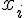  之間的關係。為了避免發生機率值小於0或大於1的不合理現象，所以會再用logit函數把機率值和整條實數線做連結。

一種 Logistic Regression 的表示式為：

  

透過 Maximum Likelihood 和  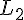  Regularization，我們可以算出要做最佳化的目標函數  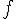  、Gradient    和 Hassian    。

-  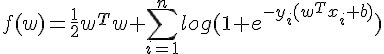 
-   
-  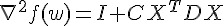 
  -   
  -   

計算上，我們要找到能夠最小化    的  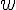  。

### 最佳化

使用者也可以挑選任何計算最佳化的函式庫，要注意的是若參數很多(    很長)的時候，函式庫建議要避開直接計算  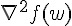  這個矩陣的方法。筆者不是最佳化的專家，找了幾個 R 內建的方式都跑不完，只好抽出 [LIBLINEAR](http://www.csie.ntu.edu.tw/~cjlin/liblinear/) 中的 trusted region 演算法來用囉。抽出來的核心已經包成一個 R 套件，請讀者在 R 中安裝 `Rcpp` 之後在 shell 執行：

```
wget https://bitbucket.org/wush978/largescalelogisticregression/get/hstrust.zip
unzip hstrust.zip
R CMD INSTALL wush978-largescalelogisticregression-4daf9c5bba5c
```

應該就可以安裝了。

### Data and Scaling

這裡以有 Big Data 的 iris 之稱的 [airline](http://stat-computing.org/dataexpo/2009/) 資料為例。這裡有自 1987 至 2008 年的飛行資料。

假設我們要研究飛機有無 Delay 和起飛的機場有無關係，就可以運用剛剛介紹的 Logistic Regression 來做分析。又為了要試試看剛剛介紹的 pbdMPI ，我們就直接依照上述的介紹，在 AWS 上開 23 台電腦，每台電腦來處理一年的資料，來試跑吧！

ps. 整趟試跑可能會花費你個位數美元左右的金額。

### Download Data

首先我們先來下載 airline 的 Data 吧。為了嘗鮮，就讓我們用 `pbdMPI` 來下載。

pbdMPI所採用的SPMD模型，就是要讓 23 台機器都來執行同樣的程式碼檔案。這也是為什麼 Master node 要用 samba 來開網路共享，這樣我們才能在 master 上編輯 script 後，能夠自動讓所有的 node 看到。

```r
library(pbdMPI)

init()

if(comm.rank() != 0) {
  url <- sprintf("http://stat-computing.org/dataexpo/2009/%d.csv.bz2", (1987:2008)[comm.rank()])
  download.file(url, "~/data.bz2")
}

finalize()
```

這裡 `init` 就是要啓動底層 mpi 的 communicators, 而 `finalize` 則是要終止 mpi communicators ，請記得在退出R程序之前 `finalize` ，否則 openmpi 會直接強制執行所有串起來的R程序的。

中間運用到的 `comm.rank` 會依照機器在 `~/pbdMPI.conf` 的順序，從 0 開始回報 R 程序的序號。運用這個序號，就可以讓 22 台 slave 各自下載對應的 airline dataset。

將檔案儲存好之後（記得放在 Repository 資料夾之後，才能讓所有電腦看到），執行：

```sh
mpirun -np 23 --hostfile ~/pbdMPI.conf Rscript xxx.R
```

23 台電腦就會執行上面的程式碼，大家一起 `init` ，一起進入邏輯判斷 `if(comm.rank() != 0)` 。所以除了 master(`comm.rank()` 為 0 的 node ) 之外，其他 22 台電腦都各自去抓取資料了！而且每台電腦抓取的資料都不同，達到分工合作的效果。最後再大家一起 `finalize`。這裡， 23 個 R 都會等到大家都執行到這之後，再各自離開程序。

這就是一個最簡單的SPMD的應用範例。

### Rds

由於下載下來的格式是.bz的壓縮檔案，我們先將格式轉成R原生的儲存格式以加快後續載入資料的速度：

```r
suppressPackageStartupMessages(library(pbdMPI))

init()

if (comm.rank() != 0) {
  data.src <- bzfile("~/data.bz2")
  airline <- read.csv(data.src, stringsAsFactors = FALSE)
  saveRDS(airline, "~/data.Rds")
}
barrier()
comm.print("Finish!")
finalize()
```

剛剛是不是覺得套件載入訊息很洗螢幕呢？我們可以用 `suppressPackageStartupMessages` 來隱藏載入訊息。

這裡我又多使用了 `barrier` 和 `comm.print` 兩個函數。`barrier` 是一個作同步的函數，它會確保 23 個 R instances 都執行到這一行之後，才會再往下執行。否則 `master` 因為不用做資料壓縮，就會一鼓作氣的印出 "finish" 後在 `finalize` 等它的好朋友，而其他的 node 就會氣喘呼呼的在那邊解壓縮資料。

`comm.print` 是一個很方便的函數，只會讓特定的 node(預設是master) 印訊息到 stdout ，畫面才不會像之前的範例這麼鬧哄哄的。

這個函數很消耗時間，所以大家可以想像如果只用一台電腦做這些事情，要等多久。

### Count Instances

接著讓我們來看一下每年各有有多少筆資料吧！

```r
suppressPackageStartupMessages(library(pbdMPI))
init()

if (comm.rank() != 0) {
  airline <- readRDS("~/data.Rds")
  n <- gather(nrow(airline))
} else {
  n <- gather(0L)
}
comm.print(n)

finalize()
```

大家應該已經熟悉 SPMD 的模式了，也可以看懂前面就是讓除了 master 以外的 node 讀取好不容易存好的 `Rds` 檔案。

`gather` 函數會將指定的物件全部依序集中到一個特定的 node ，預設是 master 。所以我們可以看到最後 `n` 就成為一個 `integer vector` ，依序代表自1987年到2008年的資料個數。

`gather` 這類函數就是MPI的賣點。 MPI 提供了許多 API 供 Process 之間傳遞訊息，讓程式設計師可以寫出平行化的程式。

另外這裡 master 的 `gather(0L, ...` 中的 `0L` 是為了保持通訊的效能。因為 `nrow(airport)` 是整數， 0L 會讓所有人傳遞的訊息是一致的，而不用做轉型。 `gather` 也可以指定 buffer ，也就是被傳遞的物件暫時儲存的地方，這可以加快 pbdMPI 通訊的速度。然而使用 buffer 也要很小心，如果傳遞的物件形態不一致時：

```r
buffer <- integer(23)
if (comm.rank() != 0) {
  n <- gather(norw(iris), b)
} else {
  n <- gather(0.0, b)
}
```

就準備看 C API 的錯誤訊息吧！！

```
Error in gather(0, b) : 
  REAL() can only be applied to a 'numeric', not a 'integer'
Calls: gather -> gather -> .Call
Execution halted
```

pbdMPI 除了提供方便的 API (會自動處理形態問題)給一般的 R 使用者之外，也提供讓熟悉R底層物件資料結構的使用者，寫出進階語法的空間。

所以最終呢，我們應該會看到：

```
COMM.RANK = 0
[[1]]
[1] 0

[[2]]
[1] 1311826

[[3]]
[1] 5202096

[[4]]
[1] 5041200

...
```

`gather` 預設是把東西裝到 `list` 之中，使用者想要直接壓成如 `integer vector` 的話，可以加上 `unlist = TRUE` 這個參數。

### Sum Instances

接著讓我們來計算 22 年來總共有多少筆資料。什麼？直接把剛剛印出來的結果加總？那不有趣啊，讓我們用 23 台電腦一起算比較熱鬧，也可以趁機再學一個函數。

```r
suppressPackageStartupMessages(library(pbdMPI))
init()

if (comm.rank() != 0) {
  airline <- readRDS("~/data.Rds")
  n <- reduce(nrow(airline), op="sum")
} else {
  n <- reduce(0L, op="sum")
}
comm.print(n)

finalize()
```

這裡要介紹的是 `reduce`，當所有 R instance 執行 reduce 之後，大家就會將第一個參數物件匯整到 master ， master 再依照 `op` 的指示來整理匯整後的資料。也就是說， `reduce` 比 `gather` 多了一個動作，而這個動作可以透過 `op` 來控制。

所以這裡的程式碼讓每個 slaves 去數自己手上資料有幾筆，然後回報給 master 後， master 再做加總。

結果應該是：

```
COMM.RANK = 0
[1] 123534969
```

### Training

接著讓我們來分析一下，到底飛機誤點和起飛的機場有沒有關係呢？

我們先丟著執行，再來講解。

```r
#! /usr/bin/Rscript

# __author__ = "Wush Wu"
# __copyright__ = "© 2013, Wush Wu"
# __license__ = "GPL 3.0"

suppressPackageStartupMessages(library(pbdMPI))
suppressPackageStartupMessages(library(Matrix))

start.time.all <- start.time <- Sys.time()

init()

if (comm.rank() != 0) {
  data <- readRDS("~/data.Rds")
  print(sprintf("nrow(data): %d (from %d)", nrow(data), (1987:2008)[comm.rank()]))
}

if (comm.rank() != 0) {
}
barrier()
comm.print(sprintf("Loading time: %0.2f secs", difftime(Sys.time(), start.time, units="secs")))
start.time <- Sys.time()

if (comm.rank() != 0) {
  origin.airport <- unique(data$Origin)
} else {
  origin.airport <- character(0)
}

origin.airport <- allgather(origin.airport, unlist=TRUE)
origin.airport <- unique(origin.airport)
comm.print(origin.airport)
invisible(gc())
comm.print("encoding training data...")
if (comm.rank() != 0) {
  train.data <- data.frame(
    y = (data$ArrDelay > 60),
    origin = factor(data$Origin, levels=origin.airport)
  )
  rm(data)
  invisible(gc())
}
barrier()
comm.print(sprintf("Encoding time: %0.2f secs", difftime(Sys.time(), start.time, units="secs")))
start.time <- Sys.time()

comm.print("constructing model matrix...")
if (comm.rank() != 0) {
  X <- sparse.model.matrix(y ~ origin, train.data)
  y <- train.data  y)]
} else {
  X <- NA
  y <- NA
}
X.size <- reduce(object.size(X), op="sum")
y.size <- reduce(object.size(y), op="sum")
comm.print(sprintf("Encoded data needs about %f GB", (y.size + X.size) / 2^30))
comm.print(sprintf("Constructing time: %0.2f secs", difftime(Sys.time(), start.time, units="secs")))
start.time <- Sys.time()

if (comm.rank() != 0) {
  x.name <- colnames(X)
} else {
  x.name <- character(0)
}
x.name.list <- gather(x.name, unlist=FALSE)
if (comm.rank() == 0) {
  x.name.list <- x.name.list[-1]
  stopifnot(
    all(sapply(1:length(x.name.list), function(i) all.equal(x.name.list[[1]], x.name.list[[i]])))
  )
  x.name <- x.name.list[[1]]
}

FUN <- 1L
GRAD <- 2L
HS <- 3L
DIE <- 4L
action_flag <- 0L

sigma <- function(x) {
  1/(1 + exp(-x))
}

mpi_fun <- function(w) {
  if (comm.rank() == 0) {
    action_flag <- bcast(FUN)
    w <- bcast(as.numeric(w))
    regularization <- sum(w^2)/2
    retval <- reduce(as.numeric(regularization), op = "sum")[1]
  } else {
    w <<- bcast(w)
    retval <- sum(log(1 + exp(ifelse(y, -1, 1) * as.vector(X %*% w))))
    retval <- reduce(as.numeric(retval), op = "sum")
  }
  retval
}

mpi_grad <- function(w) {
  if (comm.rank() == 0) {
    action_flag <- bcast(GRAD)
    w <- bcast(w)
    regularization <- w
    retval <- reduce(regularization, op = "sum")
  } else {
    w <<- bcast(w)
    y.value <- ifelse(y, 1, -1)
    x <- y.value * as.vector(X %*% w)
    d <<- sigma(x) * (1 - sigma(x))
    retval <- as.vector(((sigma(x) - 1) * y.value) %*% X)
    retval <- reduce(retval, op="sum")
  }
  retval
}

mpi_Hs <- function(unused, w) {
  if (comm.rank() == 0) {
    action_flag <- bcast(HS)
    w <- bcast(w)
    regularization <- w
    retval <- reduce(regularization, op = "sum")
  } else {
    w <<- bcast(w)
    retval <- as.vector(t(d * (X %*% w)) %*% X)
    retval <- reduce(retval, op="sum")
  }
  retval
}

mpi_finalize <- function() {
  finalize()
  quit("no")
}

if (comm.rank() != 0) {
  w.size <- ncol(X)
} else {
  w.size <- 0L
}

w.size.all <- gather(w.size, unlist=TRUE)
if (comm.rank() == 0) {
  w.size <- w.size.all[-1]
  w.size <- unique(w.size)
  stopifnot(length(w.size) == 1)
}

if (comm.rank() == 0) {
  stopifnot(require(HsTrust))
  obj <- new(HsTrust, mpi_fun, mpi_grad, mpi_Hs, length(x.name))
  r <- obj$tron(0.001, TRUE)
} else {
  while (TRUE) {
    w <- rep(0, w.size)
    action_flag <- -1L
    action_flag <- bcast(action_flag)
    if (action_flag == DIE) {
      mpi_finalize()
    }
    if (action_flag == FUN) {
      mpi_fun(w)
    }
    if (action_flag == GRAD) {
      mpi_grad(w)
    }
    if (action_flag == HS) {
      mpi_Hs(w, w)
    }
  }
}

action_flag <- bcast(DIE)
finalize()


print(sprintf("Training time: %0.2f secs", difftime(Sys.time(), start.time, units="secs")))
total.time <- as.numeric(difftime(Sys.time(), start.time.all, units="secs"))
print(sprintf("Total time: %0.2f", total.time))

save(r, x.name, file="~/r.Rdata")
```

讀者也可以先只開兩個 node:

```sh
mpirun -np 2 --hostfile ~/pbdMPI.conf Rscript xxx.R
```

這樣可以先只針對 1987 年的資料很快的跑過一遍，可以快速的檢查有沒有bug。

上述的程式碼做了以下的事情：

- 載入資料
- 整合所有的機場
    - 抽出各年資料中起飛的機場
    - `alltogether`讓所有的電腦都可以看到所有的機場
    - 將結果整理後作編碼, `factor`
- 依據編碼結果產生model matrix
    - 檢查大家編碼後的結果是否一致
- 定義`mpi_fun`, `mpi_grad`和`mpi_Hs`
- 使用trusted region optimization
- 輸出結果

### 整合所有機場

由於各年所看到的機場不一定一致，而不一致會導致 logistic regression 的結果不具有意義，所以我們要先整和這部分。好在R內建有許多好用的工具，如 `unique` 和 `factor` 可以幫助我們對資料作編碼。

編碼的意思就是，把各個機場：

```
  [1] "SAN" "SFO" "BUR" "OAK" "LAX" "PHX" "SJC" "LAS" "SNA" "SMF" "ABQ" "MFR"
...
```

依序對應到 1, 2, 3, ...  等整數。這個對應關係，務必要所有電腦都一致，所以才會有：

- 抽出各年資料中起飛的機場

    ```r
    if (comm.rank() != 0) {
      origin.airport <- unique(data$Origin)
    } else {
      origin.airport <- character(0)
    }
    ```
- `alltogether`的用法和前面介紹的`gather`一樣，差別在於不只是master，是所有的電腦都可以看到結果。所以大家就可以自己算出來所有的機場有哪些囉！

    ```r
    origin.airport <- allgather(origin.airport, unlist=TRUE)
    ```
- 將結果整理後作編碼：`factor`這個函數，其實就是把所有的類別編碼成1, 2, 3, ...，然後將所有的類別放到`levels`之中：

    ```r
    origin.airport <- unique(origin.airport)
    ...
    if (comm.rank() != 0) {
      train.data <- data.frame(
        y = (data$ArrDelay > 60),
        origin = factor(data$Origin, levels=origin.airport)
      )
      rm(data)
      invisible(gc())
    }
    ```

### Model Matrix 和 formula

由於是類別形變數，所以我們使用 Sparse Matrix 來做 Model matrix 以節省記憶體。依據編碼結果，可以透過 `sparse.model.matrix` 來產生的 model matrix:

`y ~ origin` 是 R 在做 regression-like modeling 的時候常用於表示數學式關係的R物件，又叫做 `formula`。這裡 `y ~ origin` 的意思就是：

 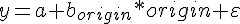 

光有關係還不夠，還要給資料來源，那就是第二個參數： `train.data` 。類似的語法可以在 `lm` 、 `glm` 和 `model.matrix` ，甚至是 `plot` 和 `aggregate` 等函數都可以用 `formula` 。這是非常方便的一個工具。

```r
X <- sparse.model.matrix(y ~ origin, train.data)
```

保險起見，檢查大家編碼後的結果是否一致:

```r
if (comm.rank() != 0) {
  x.name <- colnames(X)
} else {
  x.name <- character(0)
}
x.name.list <- gather(x.name, unlist=FALSE)
if (comm.rank() == 0) {
  x.name.list <- x.name.list[-1]
  stopifnot(
    all(sapply(1:length(x.name.list), function(i) all.equal(x.name.list[[1]], x.name.list[[i]])))
  )
  x.name <- x.name.list[[1]]
}
```

筆者是用 `colnames(X)` 來檢驗，應該每台電腦上算出來的都要一致。 `stopifnot` 是一個常用的檢驗函數，只要裡面的參數有 `FALSE` ，R就會大叫錯誤，然後直接關掉。因為沒有呼叫 `finalize` 的關係， openmpi 會毫不留情的把其他所有 R 程序，全部殺光！

### 定義 `mpi_fun`, `mpi_grad` 和 `mpi_Hs`

來到重頭戲了。

讓我們來復習一下剛剛寫的數學式子：

-   
-   
-   
  -   
  -   

但是現在呢，所有的資料，也就是    ，已經被讀者們無情的拆成 22 份了：  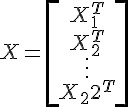  ，  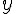  也同時被分屍了。

那每台電腦要如何各自處理手上的資料，以及最後master怎麼整合大家各自算出來的結果呢？

### 關於    的算法

其實    就是    ,    各自算，再加總，所以很直接：

```r
mpi_fun <- function(w) {
  if (comm.rank() == 0) {
    action_flag <- bcast(FUN)
    w <- bcast(as.numeric(w))
    regularization <- sum(w^2)/2
    retval <- reduce(as.numeric(regularization), op = "sum")[1]
  } else {
    w <<- bcast(w)
    retval <- sum(log(1 + exp(ifelse(y, -1, 1) * as.vector(X %*% w))))
    retval <- reduce(as.numeric(retval), op = "sum")
  }
  retval
}
```

- master算regularization:   
- 各個slave就是計算自己手上的  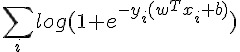  ，也就是

    ```r
    sum(log(1 + exp(ifelse(y, -1, 1) * as.vector(X %*% w))))
    ```
    
    `ifelse`這裡是要把`y`從`TRUE/FALSE`轉換成1, -1
- 最後master直接再把結果全部加起來：

    ```r
    retval <- reduce(as.numeric(regularization), op = "sum")[1]
    ```

R在學術界受到歡迎的其中一個理由就是，可以用近似數學式子的方式算出結果，看看 `sum(log(1 + exp(ifelse(y, -1, 1) * as.vector(X %*% w))))` ，不知道讀者是否同意呢？

### 關於    的算法

 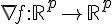 

所以這次大家要算的是和參數一樣長的向量了。仔細看看算式：

  

其實也和    一樣，大家各自算出    之後，再傳到 master 後再相加一次就可以了。

```r
mpi_grad <- function(w) {
  if (comm.rank() == 0) {
    action_flag <- bcast(GRAD)
    w <- bcast(w)
    regularization <- w
    retval <- reduce(regularization, op = "sum")
  } else {
    w <<- bcast(w)
    y.value <- ifelse(y, 1, -1)
    x <- y.value * as.vector(X %*% w)
    d <<- sigma(x) * (1 - sigma(x))
    retval <- as.vector(((sigma(x) - 1) * y.value) %*% X)
    retval <- reduce(retval, op="sum")
  }
  retval
}
```

值得一提的是，從 LIBLINEAR 的實作中的小撇步： `d <<- sigma(x) * (1 - sigma(x))` 。這等講完 Hessian 後再解釋。

### 關於    的算法

Hessian 其實是個  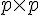  的矩陣，當資料量大，而且 feature 也大的時候，這個 Hessian 通常會拖累效能。而 LIBLINEAR 的 Trusted Region 的實作，並不需要直接算出    , 而是以    取代。而且這裡的    ，一定和前面呼叫  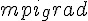  的    一致。

仔細看    的算式：

-   
  -   
  -   

讀者有沒有注意到，唯一和    有關的就是    ?由於 Trusted Region 的實作的特性，所以我們把    的計算移動到 `mpi_grad` 之中，也就是剛剛提到的： `d <<- sigma(x) * (1 - sigma(x))`

而這裡的拆解，就是慢慢把

  

展開！

最終我們會得到，每個電腦就只要計算    ，最後再由 master 加總起來就可以了。

所以就寫成：

```r
mpi_Hs <- function(unused, w) {
  if (comm.rank() == 0) {
    action_flag <- bcast(HS)
    w <- bcast(w)
    regularization <- w
    retval <- reduce(regularization, op = "sum")
  } else {
    w <<- bcast(w)
    retval <- as.vector(t(d * (X %*% w)) %*% X)
    retval <- reduce(retval, op="sum")
  }
  retval
}
```

   的計算就是 `t(d * (X %*% w)) %*% X` ，請讀者注意，這裡的 `w` 就是數學式中的    。

### 最佳化的流程

基本上， Trusted Region 的部分，也就是算難的部分，筆者完全交給 LIBLINEAR 的核心去跑。也就是說，由這個核心決定什麼時候要算 `mpi_fun`、`mpi_grad` 或 `mpi_Hs`，而計算的參數 `w`，也一切由它說了算。

所以整個流程就是：

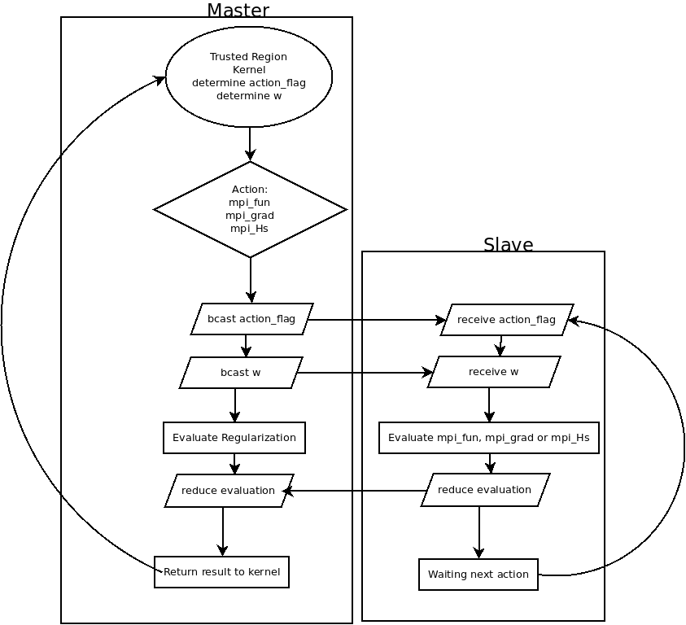

而slaves就是只要等待 master 告知：

1. 計算的動作，也就是`action_flag`
2. 計算的參數，也就是`w <- bcast(w)`

然後再由 `reduce` 把結果匯整後，由 master 回傳給核心。而 slaves 的回傳值完全不重要。

計算的過程中，讀者應該會看到：

```
iter  1 act 6.290e+05 pre 5.622e+05 delta 2.101e+00 f 8.930e+05 |g| 6.073e+05 CG   1
iter  2 act 6.752e+04 pre 5.666e+04 delta 2.101e+00 f 2.640e+05 |g| 1.312e+05 CG   1
...
```

這就是告訴讀者， LIBLINEAR 的核心已經疊代了兩次，第一次的 `mpi_fun` 的值是    ， `mpi_grad` 的結果的向量長度是    ，而 Trusted Region 算 `mpi_Hs` 算了 1 次(CG 後面的數字)以後才找到下一個 `w` 。

### 結果：

以下是筆者用 23 個 c1.medium 跑出來的結果：

```
[1] "nrow(data): 1311826 (from 1987)"
NULL
COMM.RANK = 0
[1] "Loading time: 6.10 secs"
COMM.RANK = 0
  [1] "SAN" "SFO" "BUR" "OAK" "LAX" "PHX" "SJC" "LAS" "SNA" "SMF" "ABQ" "MFR"
 [13] "SCK" "MRY" "TUS" "EUG" "SEA" "RDM" "PDX" "RNO" "ONT" "CCR" "FAT" "LGB"
 [25] "PSC" "YKM" "BLI" "GEG" "JFK" "STL" "HNL" "MIA" "SJU" "DEN" "CVG" "DCA"
 [37] "DTW" "SYR" "LGA" "BOS" "PHL" "TPA" "MCO" "MKE" "IAD" "CMH" "ORD" "PIT"
 [49] "EWR" "HOU" "SAT" "DAY" "IND" "FLL" "BNA" "CLE" "DFW" "BWI" "ORF" "COS"
 [61] "MCI" "LIT" "TUL" "BDL" "SLC" "SDF" "IAH" "JAX" "PSP" "ANC" "MSY" "OMA"
 [73] "RSW" "SRQ" "ICT" "ATL" "MDW" "AUS" "MSP" "PBI" "OKC" "MLI" "MSN" "CLT"
 [85] "DSM" "RDU" "FSD" "PIA" "SGF" "LEX" "CMI" "CID" "SUX" "TOL" "LNK" "MDT"
 [97] "ALO" "RST" "MEM" "OGG" "FAI" "KOA" "ROC" "MBS" "LIH" "SBA" "ALB" "GSO"
[109] "GRR" "BIL" "BHM" "CAE" "MHT" "ELP" "TYS" "JAN" "BFL" "HSV" "SAV" "BGR"
[121] "PWM" "ABE" "BOI" "CAK" "GTF" "BUF" "CPR" "BTV" "ISP" "RIC" "CHS" "PVD"
[133] "RAP" "CRW" "FAR" "HPN" "FOE" "ILM" "RDD" "LMT" "ACV" "ILG" "DAL" "LBB"
[145] "AMA" "CRP" "HRL" "MAF" "TLH" "GSP" "PNS" "MOB" "AVP" "GNV" "STT" "STX"
[157] "DAB" "MLB" "DRO" "GJT" "PUB" "GCN" "FLG" "YUM" "GRB" "AZO" "ERI" "FWA"
[169] "BIS" "MOT" "GFK" "VPS" "BZN" "DLH" "LSE" "EAU" "ATW" "SBN" "LAN" "MSO"
[181] "MGM" "BTR" "SHV" "CHA" "GPT" "PFN" "CWA" "ROA" "FAY" "AVL" "OAJ" "HTS"
[193] "TRI" "LYH" "MYR" "FNT" "AGS" "ORH" "CHO" "ISO" "EVV" "UCA" "APF" "EYW"
[205] "BGM" "ITH" "ELM" "LFT" "GUM" "YAP" "ROR" "SPN" "MFE" "MLU" "CSG" "FCA"
[217] "HLN" "IDA" "JAC" "JNU" "BTM" "PIE" "TVL" "PHF" "BET" "OME" "OTZ" "SCC"
[229] "KTN" "CDV" "YAK" "SIT" "PSG" "WRG" "GUC" "HDN" "PIR"
COMM.RANK = 0
[1] "encoding training data..."
COMM.RANK = 0
[1] "Encoding time: 1.04 secs"
COMM.RANK = 0
[1] "constructing model matrix..."
COMM.RANK = 0
[1] "Encoded data needs about 0.100643 GB"
COMM.RANK = 0
[1] "Constructing time: 7.52 secs"
Loading required package: HsTrust
Loading required package: Rcpp
iter  1 act 6.290e+05 pre 5.622e+05 delta 2.101e+00 f 8.930e+05 |g| 6.073e+05 CG   1
iter  2 act 6.752e+04 pre 5.666e+04 delta 2.101e+00 f 2.640e+05 |g| 1.312e+05 CG   1
iter  3 act 1.004e+04 pre 8.876e+03 delta 2.101e+00 f 1.965e+05 |g| 3.630e+04 CG   1
cg reaches trust region boundary
iter  4 act 3.455e+03 pre 3.842e+03 delta 2.101e+00 f 1.865e+05 |g| 7.325e+03 CG   2
cg reaches trust region boundary
iter  5 act 1.077e+03 pre 1.035e+03 delta 2.240e+00 f 1.830e+05 |g| 3.475e+03 CG   4
cg reaches trust region boundary
iter  6 act 3.777e+02 pre 3.796e+02 delta 2.454e+00 f 1.820e+05 |g| 9.663e+02 CG   4
[1] "Training time: 47.22 secs"
[1] "Total time: 61.88"
```

全部只要一分鐘，就可以算完約 120947440 筆資料喔。

### 結語

說實話，這裡 Demo 的數字並沒有很快。只要電腦夠好，在一台記憶體充足的電腦上，使用正確的工具和演算法，應該有機會可以更快地完成運算。但是這整套基於雲端運算的 MPI 有以下的特性：

- 以記憶體為主。和 Hadoop 相比，只要記憶體足夠，MPI為基礎的平行運算絕對在效能上可以大大勝過Hadoop這類以硬碟為主的工具和方法。
- 便宜，平民也負擔得起。又以 1TB 的資料為例，要搞到一台記憶體這麼大的電腦可能要數萬，甚至數十萬美元以上，相比之下租40台32G的AWS Instance可能一小時不到40美元。
- 和MPI相比，Hadoop 昂貴又複雜。MPI 適合規模還不夠大的企業和學界，解決一些相對單純的問題。如果事情可以用簡單的工具解決，何必用複雜的工具呢？
- 以 R 結合 C ，可以兼顧開發速度和執行效能。 80% 的程式碼用 R 實作，而 20% 的瓶頸可以用 C 來實作。
- 不需購買機器。所以對於學界等許多一次性的需求來說滿恰當的。對於企業來說，如果要長時間且持續不斷的做運算，當然自己買機器比較划算。但是在沒有真正算出來之前，怎麼能確定大數據分析後的結果真的值得那些機器的成本價格呢？雲端運算環境給大家一個機會，在花高價買機器之前可以便宜的先測試。
- 好擴充。只要能複製 AMI ，就能輕鬆擴充運算資源。目前筆者是有嘗試運用到 80 個 instance 跑運算，整體 Scaling 的效果仍然是不錯。只要錢夠，甚至可以直接把環境複製在更高性能的機器以及網路環境，用錢來換取時間。

處理不是非常非常大的數據，並不是只有 Hadoop ， MPI + R + AWS 也是一種選項。

### 作者


#### Wush Wu ([wush978@gmail.com](mailto:wush978@gmail.com))

- [Taiwan R User Group](https://www.facebook.com/Tw.R.User) Organizer
- R 相關著作：
    - [RMessenger](http://cran.r-project.org/web/packages/RMessenger/index.html)的作者
    - [RSUS](https://bitbucket.org/wush_iis/rsus)，這是[On Shortest Unique Substring Query](http://www.cs.sfu.ca/~jpei/publications/MISQ_ICDE12.pdf)的實作
- 研究領域：Large Scale Learning，[Text Mining](http://www.cs.sfu.ca/~jpei/publications/MISQ_ICDE12.pdf)和[Uncertain Time Series](http://www.cs.sfu.ca/~jpei/publications/Shortest%20Unique%20Substring%20Queries%20ICDE13.pdf)
